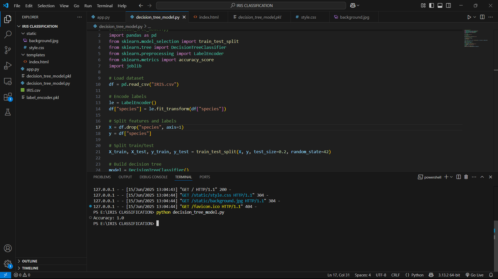
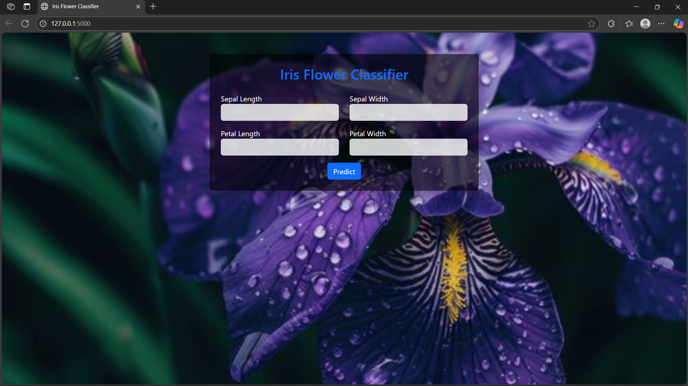

# Iris Flower Classification Web App


## 📌 Project Overview

This project is a complete web-based **Iris flower classifier**, built using **Machine Learning** and **Flask**.

It was developed as **Task 1 of my internship at Afido Tech**, with the goal of understanding how to build, test, and deploy a real-world ML model.

The app predicts the **species of an Iris flower** based on user input for:

* Sepal Length
* Sepal Width
* Petal Length
* Petal Width

---

## 🎯 Key Highlights

* ✅ Model: `DecisionTreeClassifier` from `scikit-learn`
* ✅ Dataset: Iris Dataset (150 samples, 3 classes)
* ✅ Accuracy: **96.67%** on test data (20% split)
* ✅ Tech Stack: Python, Flask, HTML/CSS, Bootstrap
* ✅ Input Validation: Real-time form-based prediction
* ✅ Creative Touch: Floral background + responsive UI

---

## 🔍 Learning Outcomes

During this project, I explored:

* Preprocessing and splitting real-world datasets
* Training and tuning Decision Trees
* Evaluating model performance using accuracy score
* Flask routing, form handling, and integration with ML model
* Web UI/UX using Bootstrap and custom styling
* Professional documentation and GitHub publishing

---

## 🚀 Screenshots


--- 


## 🛠 How to Run Locally

1. **Clone the repository**

```bash
git clone https://github.com/pratheep537/Iris-Classification.git
cd Iris-Classification
```

2. **Install required libraries**

```bash
pip install -r requirements.txt
```

3. **Run the Flask app**

```bash
python app.py
```

4. Open your browser and go to:
   👉 `http://127.0.0.1:5000`

---

## 📊 Model Performance

| Metric           | Score                                        |
| ---------------- | -------------------------------------------- |
| Accuracy         | 96.67%                                       |
| Dataset          | Iris CSV (3 classes)                         |
| Dataset    | [Iris Dataset – Kaggle](https://www.kaggle.com/datasets/saurabh00007/iriscsv) |
| Train/Test Split | 80% / 20%                                    |
| Input Features   | Sepal & Petal Length/Width                   |
| Output           | Iris-setosa, Iris-versicolor, Iris-virginica |

---

## 💼 Internship Credit

* 🏢 **Afido Tech**
* 🔧 **Task 1 – Iris Classification App**
* 🎓 Internship Role: Machine Learning Intern
* 📆 Duration: \[Fill in your internship month & year]

---

## 📂 File Structure

```text
iris_flask_project/
├── static/                  # Background image and styles
├── templates/               # HTML templates
│   └── index.html
├── iris.csv                 # Dataset used for model training
├── decision_tree_model.py   # ML model training and saving
├── app.py                   # Flask web server
├── requirements.txt         # Required Python packages
└── README.md                # This file
```

---

## 📢 Feedback and Contributions

Feel free to fork this repo, raise issues, or open pull requests!
Your feedback is appreciated 🙌

---

## 🔗 Connect with Me

* 💼 [LinkedIn](https://www.linkedin.com/in/pratheep-s537)
* 💻 [GitHub](https://github.com/pratheep537)

---

> *“Learning never exhausts the mind.”* – Leonardo da Vinci
